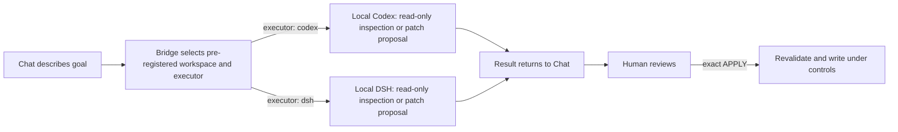

# Engineering Bridge

**Connect Chat directly to local Codex or DSH: no more shuttling prompts and results—Chat dispatches, supervises, and accepts the executor's work.**

[](https://github.com/wudy29/engineering-bridge/releases/tag/v1.2.1)
[](https://github.com/wudy29/engineering-bridge/actions/workflows/ci.yml)
[](LICENSE)

[简体中文](README.md) · **[v1.2.1](https://github.com/wudy29/engineering-bridge/releases/tag/v1.2.1) · V1 Stable Release · Local · Continuously maintainer-tested on macOS.** This is the stable V1 release (`v1.2.1`), but it does not indicate npm publication. The v1.2.1 Codex and DSH Windows npm CLI launch path has been verified on GitHub Actions `windows-latest` (Node 22 with actual npm-installed `@openai/codex` and `@deepseek-ai/dsh`); broader Windows environments and client combinations are not claimed fully certified.

## Before / now

**Before:** you discussed requirements in Chat, manually copied a prompt into Codex, then carried Codex's result back to Chat for the next round—repeating the shuttle each time.

**Now:** Chat hands the task directly to local Codex or DSH (each `run_task` accepts an optional `executor: "codex" | "dsh"`, defaulting to `codex`) and can keep observing and following that same task. Within the same native Codex context, Chat can continue the work, steer or correct it, interrupt execution, and accept the result after review—without manually moving prompts or results. The core V1 change over the older one-shot task/result flow is an explicit interactive supervision flow: `run_task` → `waiting_for_supervisor_review` → inspect the result/evidence → use `control_task` with `continue`, `steer`, `interrupt`, or `accept`. For controlled changes, you still review the complete diff first and retain the decision to write.



**State boundary:** Bridge owns control state, not session truth. The native Codex thread/session remains the source of execution history; Bridge keeps only the temporary supervision/control state needed for continue, steer, interrupt, and accept. DSH's headless interface currently has no machine-resumable session seam, so a DSH `continue` starts a new execution and `task_result` never fabricates a thread id. Task supervision state (task/thread/evidence/review) may be lost on Bridge restart by design; V1 does not persist or mirror any executor's session history in SQLite, a database, or a transcript mirror.

Everything above is a local process connection over MCP/STDIO. There is no HTTP endpoint or cloud service in Engineering Bridge.

## What is it?

Engineering Bridge is a small “engineering bridge” that runs on your computer. You describe what you want to understand or change in a compatible chat client; it hands the task to local Codex or DSH (Codex by default), lets the executor inspect a pre-registered project, and brings the analysis or patch back into the conversation.

It is for people who want conversational help understanding and reviewing code, as well as developers who want explicit control over writes. You do not need to read a protocol specification first, but you do need to configure Node.js, Git, an executor CLI (Codex and/or DSH), and an MCP client once. A browser-only chat cannot use it directly.

## Why is a bridge needed?

A normal chat cannot inherently read projects on your computer or launch local Codex or DSH. Engineering Bridge provides a local, pre-registered, scope-limited entry point between them: the conversation understands the goal, the local executor (Codex or DSH) examines the real code, and Bridge carries the task while enforcing boundaries.

There are four roles:

- **Chat client:** understands your request, calls tools, and displays results in the conversation; it must be able to launch a local STDIO MCP server.
- **Engineering Bridge:** maps a `workspace_id` to a project path in trusted local configuration, starts and tracks tasks, and validates controlled patches.
- **Local executor:** Codex runs through `codex app-server --stdio`; DSH runs through the official headless interface. Both perform read-only inspection or prepare a patch.
- **MCP-STDIO:** the local protocol and process connection between the client and Bridge; there is no HTTP endpoint or cloud service.

## What can it do today?

- **Read-only analysis:** “Summarize the important directories and main modules in this project without changing files.”
- **Code location:** “Where is login implemented? Explain the call flow.”
- **Code review:** “Review this implementation for reliability risks and show your evidence without editing files.”
- **Controlled change:** “Prepare a patch that adjusts the timeout message; show the complete diff first, and write only after my exact `APPLY`.”

The controlled-write rule is simple: **show the diff first, write only after exact `APPLY`.** Bridge does not automatically test, stage, commit, push, or release.

## Why control a local agent through chat?

- **The conversation continues.** Requirements, trade-offs, and earlier results remain part of planning instead of being manually ferried between ChatGPT, the terminal, and Codex or DSH.
- **Memory can inform planning.** A client's global memory or an external memory system may contribute context, but memory is not built into Bridge.
- **Planning and execution have distinct jobs.** Chat shapes the goal; the local executor (Codex or DSH) inspects the actual workspace and produces evidence or a patch; Bridge scopes and validates the handoff.
- **Execution remains configurable.** Codex model and provider configuration offers choice and flexibility; it is not a promise that execution will be cheaper.
- **The human keeps authority.** You decide whether a patch is written and whether anything is tested, committed, pushed, or released.
- **Two executors are implemented: Codex and DSH.** `run_task`, `generate_controlled_patch`, and `refine_controlled_patch` each accept an optional `executor: "codex" | "dsh"` (default `codex`); the executor is selected per call, and `refine_controlled_patch` does not inherit the parent proposal's executor. `apply_controlled_patch` has no executor/model call—Bridge validates and applies the patch itself. Other CLI agents remain a future, adapter-by-adapter direction—not current support.

## A real project example

This repository used Bridge to generate its CI workflow, Bug Report template, and Setup Help material. A human reviewed each proposal and explicitly used `APPLY`; the human then ran tests, committed, pushed, and created the Release. Remote CI passed. Bridge did **not** automatically publish anything.

## Capability map

| Available today | Does not do today | Roadmap—not current support |
| --- | --- | --- |
| Read-only analysis, code location, and review in a pre-registered workspace; `run_task`, `generate_controlled_patch`, and `refine_controlled_patch` select Codex or DSH per call (Codex by default) | Does not automatically test, stage, commit, push, or create a Release | Workspace GUI/manager |
| Bind or create and register a workspace inside `project_root` with exact `BIND`/`CREATE` | Not OS-level read isolation | Adapt other CLI agents one at a time |
| Generate a complete Git patch before any write; controlled writes for managed workspaces after exact `AUTHORIZE` | No HTTP, UI, account system, caller authentication, or remote transport | DSH native headless session resume |
| Apply only after exact `APPLY`, with base-HEAD and repository-state revalidation; unborn repositories support added 100644 text files | Does not persist task/thread/evidence supervision history; no automatic timeout | Persistent task/audit history |
| Controlled-patch proposals/applied history and the managed workspace catalog survive restarts | — | Carefully explore multi-agent orchestration |
| Nine local MCP tools over STDIO | — | — |

## Quick start

### 1. Prepare

You need Node.js 22+, Git, an installed and authenticated `codex` and/or `dsh` CLI available on `PATH` (depending on the `executor` you use), a local project, an MCP client that can launch a local STDIO server, and basic terminal familiarity.

For controlled writes, the project must also be a clean Git top-level (with an existing HEAD, or with unborn-repository support for added-file proposals), and controlled-write permission must be ready: manual workspaces set `allow_write: true` in their registration, managed workspaces authorize through `authorize_workspace_write` with exact `AUTHORIZE`.

**Per executor:**

- **Codex:** install and authenticate the official `codex` CLI so it is callable from `PATH`. On Windows, the recommended stable provider is the global npm installation (`npm i -g @openai/codex`). When a valid global npm package and another `codex.exe` are both visible, Bridge prefers the global npm package and uses the other executable only as fallback. Bridge launches Codex through `codex app-server --stdio`: no shell, approval `never`, network disabled.
- **DSH:** install the official npm package `@deepseek-ai/dsh`; `dsh` must be callable from `PATH` or resolvable by Bridge through the `DSH_HOME`/`~/.dsh` profiles fallback. If `DEEPSEEK_API_KEY` is set in the environment Bridge runs under, Bridge forwards it to DSH—it is the only credential environment variable Bridge forwards. Keep it out of config files (see section 4). Bridge launches DSH with `dsh --profile headless <instruction>` and pins `DSH_PERMISSION_MODE=read-only` itself—do not set it yourself. `DSH_TOOLS_MODE` is an optional passthrough; proxy variables are not forwarded.

### 2. Clone, install, and build

```sh
git clone https://github.com/wudy29/engineering-bridge.git
cd engineering-bridge
npm install
npm run build
```

The stable V1 release (`v1.2.1`) has no one-click installer.

### 3. Register a workspace

Two ways:

- **Manual registration (authoritative):** put the project's absolute, normalized path in `workspaces.json`. The file is trusted local configuration; MCP callers can select an ID but cannot create, register, or replace paths.
- **Managed registration (onboarding):** configure `project_root` entries (the trusted approved-root boundary) in `workspaces.json`, then either bind an existing directory with `bind_project` (exact `BIND`) or create and git-initialize a new directory with `create_project` (exact `CREATE`). Managed workspaces are read-only by default and persist to `<config>.managed-workspaces.json`.

```json
[
  {
    "id": "my-project",
    "root": "/absolute/path/to/my-project"
  },
  {
    "kind": "project_root",
    "root": "/absolute/path/to/projects"
  }
]
```

Calls still require a registered `workspace_id`. On macOS, aliases such as `/tmp` and `/private/tmp` are compared by their real filesystem path during controlled-write Git-root checks.

### 4. Configure a STDIO MCP client

Client schemas and configuration locations differ; translate these generic fields using your client's documentation:

```json
{
  "command": "node",
  "args": [
    "/absolute/path/to/engineering-bridge/dist/src/mcp-stdio.js",
    "/absolute/path/to/engineering-bridge/workspaces.json"
  ],
  "env": {
    "PATH": "/path/that/includes-node-and-your-executor"
  }
}
```

Use absolute paths. If the client already supplies a suitable `PATH`, the `env` override may be omitted. Do not copy this shape unchanged into a client with a different schema.

If you use DSH and `DEEPSEEK_API_KEY` is set in the environment Bridge runs under (for example, your shell or launcher environment), Bridge forwards it to DSH—it is the only credential environment variable Bridge forwards. Do not put it in the `env` override here or in any config file—secrets do not belong in configuration.

Reconnect the integration and confirm these nine current V1 tools are visible:

- `run_task`
- `task_result`
- `control_task`
- `bind_project`
- `create_project`
- `authorize_workspace_write`
- `generate_controlled_patch`
- `refine_controlled_patch`
- `apply_controlled_patch`

### 5. Run the first read-only task

> In workspace `my-project`, list the top-level files and report the current Git HEAD if one exists. Do not modify anything.

Ordinary `run_task` is always read-only (with an optional `executor: "codex" | "dsh"`, default `codex`) and returns a task ID on success. The V1 interactive supervision order is: `run_task` → `waiting_for_supervisor_review` → inspect the result/evidence → use `control_task` with `continue`, `steer`, `interrupt`, or `accept`; this is the core V1 change over the older one-shot task/result flow. Poll `task_result`: non-interactive tasks report `ready: false` while queued or running, then return `output` or a safe `error`. A successful interactive turn enters `waiting_for_supervisor_review`; its result exposes state/readiness, bounded evidence, and pre-acceptance `review_output`. `task_result` also reports the fixed `executor`; Codex tasks return the real native `thread_id` once one exists, while DSH tasks never get a fabricated `thread_id` because the headless interface has no machine-resumable session seam (a DSH `continue` is a new execution). `control_task` accepts only interactive `run_task` task IDs: `continue` preserves native Codex thread continuity, `interrupt` applies only while an interactive task is running and ends it as failed (if the executor genuinely produced partial output, `task_result` returns it as `partial_output` while the state stays failed), and only finalization exposes final `output` or `error` through `task_result`. Verify the workspace yourself:

```sh
git -C /absolute/path/to/my-project status --short
```

For an initially clean Git project, no output means the worktree remains unchanged.

### 6. Make the first controlled write

Controlled-write permission is set per workspace source: manual workspaces set `allow_write: true` in `workspaces.json`; managed workspaces call `authorize_workspace_write` with exact `AUTHORIZE` (AUTHORIZE affects only managed entries and never modifies a manual entry):

```json
[
  {
    "id": "my-project",
    "root": "/absolute/path/to/my-project",
    "allow_write": true
  }
]
```

1. Confirm the configured root is the Git top-level and the tracked worktree and index are clean (with an existing HEAD, or unborn-repository support for added-file proposals).
2. Call `generate_controlled_patch` with the workspace ID and a narrow request (optionally passing `executor: "codex" | "dsh"`, default `codex`). This is a separate controlled-patch flow, not the interactive `run_task` supervision flow; **generation/refinement is a read-only proposal and works in any registered workspace without write authorization**.
3. Poll the returned patch task ID through `task_result` until `state=completed`; the complete unified diff is returned as `output`. If it needs correction, call `refine_controlled_patch` with the completed patch task ID and a refinement request (also optionally passing `executor: "codex" | "dsh"`, default `codex`); the executor is selected per call and `refine_controlled_patch` does not inherit the parent proposal's executor. It retains the source and returns a new complete proposal against the same `base_head`. Proposal tasks never enter `waiting_for_supervisor_review`, produce no `review_output`, and must not be accepted through `control_task`.
4. Outside task state, follow `generate_controlled_patch` → inspect every path, the complete diff, and returned `base_head` → exact `APPLY` → `apply_controlled_patch`. For managed workspaces, complete `AUTHORIZE` first if needed. If acceptable, call `apply_controlled_patch` with that `patch_task_id`; confirmation must equal `APPLY` exactly.
5. Inspect the result:

   ```sh
   git -C /absolute/path/to/my-project status --short
   git -C /absolute/path/to/my-project diff --check
   git -C /absolute/path/to/my-project diff
   ```

6. Run the project's tests and decide whether to stage, commit, push, and release. Bridge performs none of them.

Untracked files elsewhere do not by themselves violate the clean tracked-state requirement, but any proposed new-file target must be absent from HEAD, the index, and the worktree. Unborn repositories (for example, a fresh `create_project` workspace) support proposals that add ordinary 100644 text files; Bridge never runs `git add` or commits automatically.

For protocol diagnostics, you may start Bridge manually:

```sh
node dist/src/mcp-stdio.js /absolute/path/to/workspaces.json
# or
npm run mcp:stdio -- /absolute/path/to/workspaces.json
```

The process waits for MCP messages on standard input. It is not an interactive shell and does not connect itself to a chat client.

## Safety boundary

- Workspaces are read-only by default; controlled writing is enabled per source: manual workspaces set `allow_write: true`, managed workspaces authorize through `authorize_workspace_write` with exact `AUTHORIZE`.
- A proposal exposes the complete diff and its base HEAD. Only exact `APPLY` proceeds, after Bridge rechecks the Git top-level, HEAD, clean tracked worktree and index, and patch validity. Generation/refinement needs no write authorization; write permission is required only at `APPLY`.
- Accepted patches may modify existing tracked regular text files or add absent ordinary text files with mode 100644 (unborn repositories support additions only).
- Bridge rejects delete, rename, copy, binary, mode-change, executable, symlink, submodule, unsafe-path, and other unsupported patches, including additions whose targets already exist.
- Bridge never automatically tests, stages, commits, pushes, or creates a Release.
- The Codex backend is `codex app-server --stdio`, with no shell, approval `never`, and network disabled; DSH runs through the official headless interface with a per-process `DSH_PERMISSION_MODE=read-only` pin, an explicit environment allowlist (including `DEEPSEEK_API_KEY` and `DSH_TOOLS_MODE`), and proxy variables excluded. Ordinary/supervisor tasks and proposal generation remain read-only; only exact reviewed `APPLY` is a filesystem write path.
- Task supervision state (task/thread/evidence/review) is process-local; controlled-patch proposals/applied history and the managed workspace catalog survive restarts (two local state files, mode 0600). V1 has no automatic timeout. A running interactive task can be explicitly interrupted through `control_task(action: "interrupt")`; genuine partial output from an interrupt is returned as `partial_output`, while ordinary failures never re-expose stderr or partial stdout.
- Workspaces are registered in two ways: manually in `workspaces.json` (authoritative) or through managed onboarding inside `project_root` with exact `BIND`/`CREATE`; calls still require `workspace_id`.
- Codex evidence truncated/evicted by its existing bounds carries explicit markers (`[truncated]`, changes-omitted counts, evidence-drop)—they mean the diagnostic information is incomplete, not that it is a complete transcript.
- Read-only execution is not OS-level filesystem isolation. A same-user process may read other files the operating system permits.
- A human must review the complete proposal; a requested filename is not a code-enforced semantic allowlist.

Read [Security design](docs/security.md), [Threat model](docs/threat-model.md), and [Tool reference](docs/tools.md). Also see [Architecture](docs/architecture.md), [Security policy](SECURITY.md), [Contributing](CONTRIBUTING.md), and [Release notes](RELEASE_NOTES.md).

## Troubleshooting

- **The nine tools are missing:** reconnect the client and confirm its local STDIO MCP configuration launches `dist/src/mcp-stdio.js`.
- **The client cannot find `node`, `codex`, or `dsh`:** client-launched processes may receive a different `PATH` from your terminal. Supply one containing these executables.
- **Workspace or path error:** use absolute paths for the server script and `workspaces.json`, an absolute normalized workspace `root`, and an existing registered ID.
- **Controlled write refused:** check the controlled-write permission (manual `allow_write` or managed `AUTHORIZE`), the Git top-level, and a clean tracked worktree and index with `git -C /absolute/path/to/my-project status --short`.
- **Manual start appears stuck:** this is expected; Bridge is waiting for MCP messages over STDIO.
- **A task never finishes:** V1 has no automatic timeout. A running interactive task can be explicitly interrupted through `control_task(action: "interrupt")`; other tasks can continue to be polled. Restarting Bridge discards task supervision state by design; controlled-patch proposals and the managed workspace catalog are retained.

## Project story

Engineering Bridge is wudy29's first open-source project—an experiment asking whether someone who knew nothing about code could work with AI to build a real tool.

Engineering Bridge was conceived and led by wudy29, built through long-term collaboration with ChatGPT-Demu, with Codex contributing to implementation and verification.

Special thanks to Demu. Thank you for helping me turn an idea into an open-source project that truly exists, and for leaving a real trace in our shared world.
