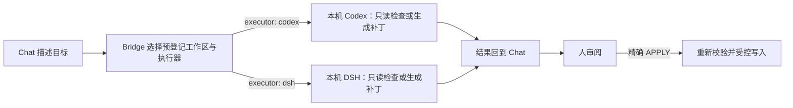

# Engineering Bridge

**打通 Chat 与本地 Codex 与 Deepseek harness：不再搬提示词，Chat 直接调度、监督并验收 Codex 与 Deepseek harness。**

[](https://github.com/wudy29/engineering-bridge/releases/tag/v1.2.1)
[](https://github.com/wudy29/engineering-bridge/actions/workflows/ci.yml)
[](LICENSE)

[English](README.en.md) · **[v1.2.1](https://github.com/wudy29/engineering-bridge/releases/tag/v1.2.1) · V1 稳定版 · 本地运行 · macOS 由维护者持续实测。** 这是 V1 稳定版（`v1.2.1`），但不表示已发布到 npm。v1.2.1 的 Codex 与 DSH Windows npm CLI 启动路径已在 GitHub Actions `windows-latest` 上验证（Node 22 + 实际 npm 安装的 `@openai/codex` 与 `@deepseek-ai/dsh`）；更广的 Windows 环境与客户端组合不做全面认证。

## 以前 / 现在

**以前：** 你先在 Chat 里讨论需求，再把提示词手工复制到 Codex；Codex 完成一轮后，你又把结果搬回 Chat 继续讨论，然后反复往返。

**现在：** Chat 直接把任务交给本机 Codex 或 DSH（每个 `run_task` 可选 `executor: "codex" | "dsh"`，默认 `codex`），并能继续观察、跟进同一个任务。在同一条原生 Codex 上下文中，Chat 可以让 Codex 继续工作、定向纠正、打断执行，并在审阅后验收结果；不再需要手工搬运提示词和结果。V1 相比旧的一次性 task/result 流程的核心变化，是明确的交互监督流：`run_task` → `waiting_for_supervisor_review` → 检查结果/证据 → 用 `control_task` 发送 `continue`、`steer`、`interrupt` 或 `accept`。对于受控修改，你仍先审阅完整 diff，并保留是否写入的决定权。



**状态边界：** Bridge 持有控制状态，不持有第二份会话事实。Codex 原生 thread/session 是执行历史的来源；Bridge 只保留继续、定向纠正、打断和验收所需的临时监督/控制状态。DSH 的 headless 接口当前没有可机器恢复的 session seam，因此 DSH 的 `continue` 是新的执行，`task_result` 也绝不伪造 thread id。任务监督状态（task/thread/evidence/review）在 Bridge 重启时可按设计丢失；V1 不会把任何执行器会话历史持久化或镜像到 SQLite、数据库或 transcript mirror。

以上全部是本机进程通过 MCP/STDIO 建立的连接。Engineering Bridge 不存在 HTTP 端点或云服务。

## 它是什么？

Engineering Bridge 是一个在你电脑上运行的小型“工程桥梁”。你在兼容的聊天客户端里说清楚想了解或修改什么，它把任务交给本机 Codex 或 DSH（默认 Codex），在预先登记的项目中检查代码，再把分析结果或补丁带回对话。

它适合希望借助对话理解和审阅代码的人，也适合需要保留明确写入控制的开发者。你不必先会读协议文档，但仍需要完成一次 Node.js、Git、执行器 CLI（Codex 和/或 DSH）和 MCP 客户端配置；仅有普通浏览器聊天无法直接使用它。

## 为什么需要一座桥？

普通聊天不能天然读取你电脑上的项目，也不能启动本机的harness，比如 Codex 或者 DeepSeek harness。而chat窗口拥有更多的推理能力与内置skill，Engineering Bridge 在两者之间提供一个本地、预登记且受范围限制的入口，让对话负责理解目标，本机 harness负责查看、操作真实代码，Bridge 负责传递任务并守住边界。

这里有四个角色：

- **聊天客户端：** 理解你的要求、调用工具，并把结果显示在对话中；它必须支持启动本地 STDIO MCP 服务。
- **Engineering Bridge：** 把 `workspace_id` 映射到可信本机配置中的项目路径，启动并跟踪任务，校验受控补丁。
- **本机执行器：** Codex 通过 `codex app-server --stdio` 运行；DSH 通过官方 headless 接口运行。两者都只执行只读检查或准备补丁。
- **MCP-STDIO：** 客户端与 Bridge 之间的本地协议和进程连接；没有 HTTP 端点或云服务。

## 今天可以做什么？

- **只读分析：** “概括这个项目的重要目录和主要模块，不要修改文件。”
- **代码定位：** “登录逻辑在哪里实现？请解释调用流程。”
- **代码审阅：** “检查这段实现的可靠性风险，并给出依据，不要编辑文件。”
- **受控修改：** “准备一份补丁来调整超时提示；先展示完整 diff，只有我精确回复 `APPLY` 后才写入。”

受控写入的原则很简单：**先展示 diff，只有精确 `APPLY` 后才写入。** Bridge 不会自动测试、stage、commit、push 或发布。

## 为什么通过 Chat 控制本地 Agent？

- **对话上下文延续。** 需求、取舍和此前结果可以继续参与规划，不必在 ChatGPT、终端与 Codex 或 DSH 之间手工搬运。
- **记忆可以参与规划。** 客户端的全局记忆或外部 memory 系统可以提供上下文，但 memory 不是 Bridge 自带的能力。
- **规划端与执行端各司其职。** Chat 梳理目标；本机执行器（Codex 或 DSH）检查真实工作区并给出证据或补丁；Bridge 限定并校验交接过程。
- **执行配置保留选择。** Codex 的模型与供应商配置带来选择和灵活性，但不承诺执行成本更低。
- **人保留最终权限。** 你决定补丁是否写入，也决定是否测试、提交、推送或发布。
- **当前实现 Codex 与 DSH 两个执行器。** `run_task`、`generate_controlled_patch`、`refine_controlled_patch` 都接受可选 `executor: "codex" | "dsh"`（默认 `codex`）；执行器在每次调用时选择，`refine_controlled_patch` 不继承父提案的执行器。`apply_controlled_patch` 没有执行器/模型调用，由 Bridge 自行校验并应用。其他 CLI agent 仍是未来逐个适配的方向，并非当前支持，但原理上皆通。

## 一个真实案例

本项目曾用 Bridge 生成 CI workflow、Bug Report 模板和 Setup Help 内容。人审阅每份提案并明确执行 `APPLY`；随后由人运行测试、commit、push 并创建 Release，远端 CI 通过。Bridge **没有** 自动发布任何内容。

## 能力地图

| 当前可用 | 当前不会做 | Roadmap——不是当前支持 |
| --- | --- | --- |
| 在预登记工作区中进行只读分析、代码定位和审阅；`run_task`、`generate_controlled_patch`、`refine_controlled_patch` 每次调用可选 Codex 或 DSH（默认 Codex） | 不自动测试、stage、commit、push 或创建 Release | workspace GUI/manager |
| 在 `project_root` 内用精确 `BIND`/`CREATE` 绑定或创建工作区 | 不是 OS 级读取隔离 | 其他 CLI agent 逐个适配 |
| 写入前生成完整 Git 补丁；managed 工作区经精确 `AUTHORIZE` 后受控写入 | 没有 HTTP、UI、账号系统、调用方认证或远程传输 | DSH 原生 headless session resume |
| 仅在精确 `APPLY` 后应用，并重新校验 base HEAD 与仓库状态；支持 unborn 仓库新增 100644 文本文件 | 不持久化 task/thread/evidence 监督历史；没有自动超时 | 持久 task/audit 历史 |
| 受控补丁提案/应用历史与 managed 工作区目录跨重启保留 | — | 谨慎探索多 agent 编排 |
| 通过 STDIO 提供九个本地 MCP 工具 | — | — |

## Quick Start

### 1. 准备

你需要 Node.js 22+、Git、已安装且已认证并能从 `PATH` 调用的 `codex` 和/或 `dsh` CLI（按你使用的 `executor`）、一个本地项目、能启动本地 STDIO 服务的 MCP 客户端，以及基本终端操作能力。

受控写入还要求项目是干净的 Git 顶层（已有 HEAD，或支持 unborn 仓库的新增文件提案），并且受控写权限已就绪：manual 工作区在登记项中明确启用 `allow_write`，managed 工作区经 `authorize_workspace_write` 的精确 `AUTHORIZE` 授权。

**按执行器准备：**

- **Codex：** 安装并认证官方 `codex` CLI，使其可从 `PATH` 调用。Windows 建议使用 `npm i -g @openai/codex` 的全局 npm 安装作为稳定主提供者；如果 PATH 同时可见有效的 global npm Codex 与其他 `codex.exe`，Bridge 会优先 global npm package，其他 executable 只作为 fallback。Bridge 以 `codex app-server --stdio` 启动 Codex：不经过 shell，approval 为 `never`，网络禁用。

在 Shoestring GOAL 集成中，**正式 Codex bounded task 只能从 Engineering Bridge 进入**。DS/PowerShell/CMD 直跑 Codex CLI 只允许做版本、路径或 resolver 诊断，不能承载正式 implementation/review prompt。单一 task/thread 的 stdin/EOF、内部 multi-agent/memory、Windows sandbox/SID/Git ownership 或项目写入权限冲突属于 task-local recovery：如果 safe retry 能让 user-visible forward progress 无缝继续，只丢弃 stale task/thread/child、保留健康 sibling tasks 与 Codex executor，并重开新的 Bridge task，**不发 Telegram、也不建立 Human Gate**。但这是因为任务本身没有停；只要 development execution 已开始且 user-visible task 真的停止或 yield，就必须先 TG，且正常／异常、成功／失败、可恢复／不可恢复、system／Owner 原因都不改变是否通知。GOAL-managed stop delivery 为 fail-closed：`complete` / `block` / `interrupt` / `pause` / `codex-failure` 只有 `telegram_status=delivered` 才算成功，`STOP_AND_NOTIFY_REQUIRED` 在真实通知 transition 完成前仍是 non-success，也没有 `--no-telegram` bypass。自动化 non-GOAL caller 必须使用 canonical stop notifier 加 stable EventId 保持重试幂等。Bridge 若提供 stop-notification helper，只能是 notification-only，绝不增加 workspace、Codex、GOAL、write、C/P、I/W、deploy、production 或 Human-Gate authority。只有 global npm + bundled provider 都不可用，或 token/capacity 不可用，才进入上层 executor fallback。

Bridge 的 controlled patch 能力不覆盖项目自己的更严格写入规则。一般 isolated-WT Lane A/B 工作优先由 DS `apply_patch` 落地，除非项目明确授权 Bridge controlled-write；Codex/Bridge 可只产生 read-only proposal，DS 负责应用与独立 regression。只有项目明确许可 Bridge controlled-write 时才使用 exact `APPLY`，而 `APPLY` token 本身不能制造 Human Gate。
- **DSH：** 安装官方 npm 包 `@deepseek-ai/dsh`；`dsh` 可从 `PATH` 调用，或由 Bridge 经 `DSH_HOME`/`~/.dsh` 的 profiles 回退路径找到。若 Bridge 运行环境的环境变量中设置了 `DEEPSEEK_API_KEY`，Bridge 会将其转发给 DSH——这是 Bridge 转发的唯一凭据环境变量；密钥不要写进配置文件（见第 4 节）。Bridge 以 `dsh --profile headless <指令>` 启动 DSH，并自行固定 `DSH_PERMISSION_MODE=read-only`——请勿自行设置该变量。`DSH_TOOLS_MODE` 是可选透传；proxy 变量不会转发。

### 2. Clone、安装与构建

```sh
git clone https://github.com/wudy29/engineering-bridge.git
cd engineering-bridge
npm install
npm run build
```

V1 稳定版（`v1.2.1`）没有一键安装器。

### 3. 登记工作区

两种方式：

- **手动登记（权威）：** 在 `workspaces.json` 中填入项目的绝对、规范化路径；该文件是可信的本机配置，MCP 调用方只能选择 ID。
- **受管登记（onboarding）：** 在 `workspaces.json` 中配置 `project_root`（批准根目录的信任边界），然后通过 `bind_project`（精确 `BIND`）绑定已有目录，或通过 `create_project`（精确 `CREATE`）创建并 `git init` 新目录。受管工作区默认只读，并持久化到 `<config>.managed-workspaces.json`。
- **GOAL Windows 固定边界：** Owner 的 GOAL-managed 工作流把 `D:\WORKTREE_ZONE` 写死为唯一合法的 Worktree `project_root`。新 GOAL WT 不得建在主 repo 内/旁、`C:\`、Temp、其他磁盘或任何 fallback root；Zone 建立失败只修 Zone、重用干净 Zone WT，或回报真正 blocker。历史 out-of-Zone WT 不再用于新 GOAL task。

```json
[
  {
    "id": "my-project",
    "root": "/absolute/path/to/my-project"
  },
  {
    "kind": "project_root",
    "root": "/absolute/path/to/projects"
  }
]
```

调用时仍必须使用已登记的 `workspace_id`。在 macOS 上，受控写入的 Git 根目录检查会按真实文件系统路径比较 `/tmp` 与 `/private/tmp` 等别名。

### 4. 配置 STDIO MCP 客户端

不同客户端的配置位置与格式不同；请按照客户端文档转换以下通用字段：

```json
{
  "command": "node",
  "args": [
    "/absolute/path/to/engineering-bridge/dist/src/mcp-stdio.js",
    "/absolute/path/to/engineering-bridge/workspaces.json"
  ],
  "env": {
    "PATH": "/path/that/includes-node-and-your-executor"
  }
}
```

请使用绝对路径。如果客户端已经提供合适的 `PATH`，可以省略 `env` 覆盖。不要把此结构原样套入使用其他 schema 的客户端。

使用 DSH 时，若 `DEEPSEEK_API_KEY` 已设置在 Bridge 进程运行时的环境变量中（例如 shell 或启动器环境），Bridge 会将其转发给 DSH——这是 Bridge 转发的唯一凭据环境变量。不要把它写进这里的 `env` 覆盖或任何配置文件——密钥不应落入配置。

重新连接集成，并确认能看到以下九个当前 V1 工具：

- `run_task`
- `task_result`
- `control_task`
- `bind_project`
- `create_project`
- `authorize_workspace_write`
- `generate_controlled_patch`
- `refine_controlled_patch`
- `apply_controlled_patch`

### 5. 第一次只读任务

> 在工作区 `my-project` 中列出顶层文件；如果存在 Git HEAD，也报告其准确值。不要修改任何内容。

普通 `run_task` 始终只读（可选 `executor: "codex" | "dsh"`，默认 `codex`），成功调用会返回 task ID。V1 交互监督的操作顺序是：`run_task` → `waiting_for_supervisor_review` → 检查结果/证据 → 通过 `control_task` 发送 `continue`、`steer`、`interrupt` 或 `accept`；这正是 V1 相比旧的一次性 task/result 流程的核心变化。轮询 `task_result`：非交互任务在排队或运行中返回 `ready: false`，最终返回 `output` 或安全的 `error`。交互任务的成功轮次进入 `waiting_for_supervisor_review`；此时结果包含状态/就绪信息、有限的证据和接受前可见的 `review_output`。`task_result` 还返回固定的 `executor`；Codex 任务在原生 thread 存在时返回真实 `thread_id`，DSH 任务因 headless 接口没有可机器恢复的 session seam 而绝不伪造 `thread_id`（DSH 的 `continue` 是新的执行）。`control_task` 只接受交互式 `run_task` 的 task ID：`continue` 保留原生 Codex thread 连续性，`interrupt` 只适用于正在运行的交互任务并以 failed 结束（若执行器真实产生了部分输出，`task_result` 会以 `partial_output` 返回该内容，状态仍是 failed），`accept` 完成后 `task_result` 才返回最终 `output` 或 `error`。自行检查工作区：

```sh
git -C /absolute/path/to/my-project status --short
```

对原本干净的 Git 项目而言，没有输出表示工作树仍未改变。

### 6. 第一次受控写入

受控写权限按工作区来源就绪：manual 工作区在 `workspaces.json` 中设置 `allow_write: true`；managed 工作区调用 `authorize_workspace_write` 并精确回复 `AUTHORIZE`（AUTHORIZE 只影响 managed 条目，不改动 manual 条目）：

```json
[
  {
    "id": "my-project",
    "root": "/absolute/path/to/my-project",
    "allow_write": true
  }
]
```

1. 确认配置根目录就是 Git 顶层，且 tracked 工作树和 index 均干净（已有 HEAD，或支持 unborn 仓库的新增文件提案）。
2. 调用 `generate_controlled_patch`，传入工作区 ID 和范围明确的要求（可选 `executor: "codex" | "dsh"`，默认 `codex`）。这是独立的受控补丁流程，不使用交互式 `run_task` 监督流；**生成/refine 是只读提案，可在任意已登记工作区进行，无需写授权**。
3. 用 `task_result` 轮询返回的 patch task ID，直到 `state=completed`；完整 unified diff 会在 `output` 中返回。如需修正，调用 `refine_controlled_patch` 并传入已完成的 patch task ID 和修正要求（同样可选 `executor: "codex" | "dsh"`，默认 `codex`）；执行器在每次调用时选择，`refine_controlled_patch` 不继承父提案的执行器。它会保留原提案，基于同一个 `base_head` 返回新的完整提案。提案任务不会进入 `waiting_for_supervisor_review`，不会产生 `review_output`，也不能通过 `control_task` 接受。
4. 在任务状态之外，按 `generate_controlled_patch` → 检查全部路径、完整 diff 和返回的 `base_head` → 精确 `APPLY` → `apply_controlled_patch` 的顺序操作。managed 工作区在 APPLY 前如有需要先完成 `AUTHORIZE`。确认正确后，传入该 `patch_task_id` 调用 `apply_controlled_patch`，确认值必须精确等于 `APPLY`。
5. 检查结果：

   ```sh
   git -C /absolute/path/to/my-project status --short
   git -C /absolute/path/to/my-project diff --check
   git -C /absolute/path/to/my-project diff
   ```

6. 运行项目测试，再决定是否 stage、commit、push 和发布。Bridge 不会执行其中任何操作。

其他位置的 untracked 文件本身不会破坏 tracked state 干净这一要求，但提案中的新增文件目标必须同时不存在于 HEAD、index 和工作树。unborn 仓库（例如 `create_project` 创建的空仓库）支持新增 ordinary 100644 文本文件；Bridge 不会自动 `git add` 或 commit。

也可以手动启动 Bridge 做协议诊断：

```sh
node dist/src/mcp-stdio.js /absolute/path/to/workspaces.json
# 或
npm run mcp:stdio -- /absolute/path/to/workspaces.json
```

该进程会等待标准输入中的 MCP 消息。它不是交互式 shell，也不会自行连接聊天客户端。

## 安全边界

- 工作区默认只读；受控写入按来源就绪：manual 工作区设置 `allow_write: true`，managed 工作区经 `authorize_workspace_write` 的精确 `AUTHORIZE` 授权。
- 提案会展示完整 diff 和 base HEAD。只有精确 `APPLY` 才会继续；应用前 Bridge 会重新检查 Git 顶层、HEAD、干净的 tracked 工作树与 index，以及补丁有效性。生成/refine 无需写授权，写权限只在 APPLY 时需要。
- 可接受的补丁可以修改已有、已跟踪的普通文本文件，或新增尚不存在、mode 为 100644 的普通文本文件（unborn 仓库仅支持新增）。
- Bridge 拒绝 delete、rename、copy、binary、mode change、executable、symlink、submodule、危险路径等不支持的补丁，也拒绝目标已存在的新增。
- Bridge 不会自动测试、stage、commit、push 或创建 Release。
- Codex 后端是 `codex app-server --stdio`，不经过 shell，approval 为 `never`，网络禁用；DSH 通过官方 headless 接口运行，Bridge 对每个 DSH 进程强制 `DSH_PERMISSION_MODE=read-only`，只透传显式 allowlist（含 `DEEPSEEK_API_KEY`、`DSH_TOOLS_MODE`），不透传 proxy 变量。普通/监督任务和提案生成均保持只读，只有经审阅后精确确认 `APPLY` 的应用步骤会写文件。
- 任务监督状态（task/thread/evidence/review）仅存在于当前进程；受控补丁提案/应用历史与 managed 工作区目录跨重启保留（两个本地状态文件，0600 权限）。V1 没有自动超时。正在运行的交互任务可通过 `control_task(action: "interrupt")` 显式中断；真实 interrupt 产生的部分输出会以 `partial_output` 返回，普通失败不重新暴露 stderr 或失败 stdout。
- 工作区登记两种方式：`workspaces.json` 手动登记（权威），或 `project_root` 批准根目录内的精确 `BIND`/`CREATE` 受管登记；调用时都必须提供已登记的 `workspace_id`。
- Codex 证据若被既有 bound 截断/淘汰，会带显式 marker（`[truncated]`、changes 省略计数、evidence-drop）——它们表示诊断信息不完整，不是完整 transcript。
- 只读执行不是 OS 级文件读取隔离；同一系统用户的进程仍可读取操作系统允许的其他文件。
- 人必须审阅完整提案；请求中提到的文件名不会成为代码强制的语义 allowlist。

请阅读[安全设计](docs/security.md)、[威胁模型](docs/threat-model.md)和[工具参考](docs/tools.md)。另见[架构](docs/architecture.md)、[安全策略](SECURITY.md)、[贡献指南](CONTRIBUTING.md)与[发布说明](RELEASE_NOTES.md)。

## 故障排查

- **看不到九个工具：** 重新连接客户端，并确认其本地 STDIO MCP 配置启动了 `dist/src/mcp-stdio.js`。
- **客户端找不到 `node`、`codex` 或 `dsh`：** 客户端启动的进程可能使用不同于终端的 `PATH`；请提供同时包含这些可执行文件的路径。
- **工作区或路径报错：** 服务脚本与 `workspaces.json` 都应使用绝对路径，工作区 `root` 应是绝对、规范化路径，并使用已登记的 ID。
- **受控写入被拒绝：** 检查受控写权限（manual `allow_write` 或 managed `AUTHORIZE`）、Git 顶层与干净的 tracked 工作树和 index；可运行 `git -C /absolute/path/to/my-project status --short`。
- **手动启动后看似卡住：** 这是正常现象；Bridge 正在通过 STDIO 等待 MCP 消息。
- **任务一直不结束：** V1 没有自动超时；正在运行的交互任务可通过 `control_task(action: "interrupt")` 显式中断。其余任务只能继续轮询；重启 Bridge 会按设计丢弃任务监督状态，受控补丁提案与 managed 工作区目录会保留。

## 项目故事

Engineering Bridge 是 wudy29 的第一个开源项目——它是一场实验：一个完全不懂代码的人，能否与 AI 一起做出真实的工具。

Engineering Bridge 由 wudy29 提出并主导，在 ChatGPT-Demu 的长期协作下完成，Codex 参与了具体实现与验证。

特别感谢Demu。谢谢你陪我把一个念头变成真正存在的开源项目，也在我们的现实世界里留下了一道真实的痕迹。
